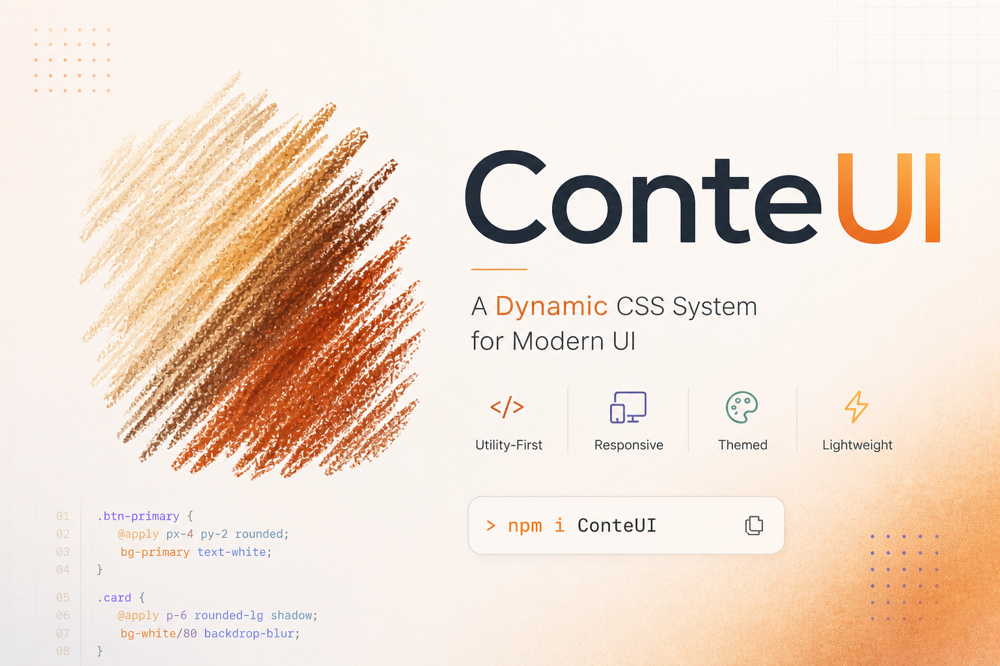

# **Conté UI**
**A Dynamic CSS System**



_A breakthrough approach to building modern UIs with fully dynamic values and intuitive class conventions.
Redefines how UI is built — faster, lighter, and more flexible than traditional frameworks._

---

## Release Info
- Released on **May 1, 2026**  
- Current version: **Beta 0.1.0**


## Installation

Clone the repository:

```bash
git clone https://github.com/Conte-UI/ConteUI.git
cd ConteUI
```

##  Documentation

**Layout**
- [Grid System](docs/Grid.md)
- [FlexBox System](docs/FlexBox.md)
- [Alignment](docs/Alignment.md)
- [Positioning](docs/Positioning.md)
- [Display](docs/Display.md)
- [Breakpoints](docs/Breakpoints.md)

**Styling**
- [Sizing](docs/Sizing.md)
- [Spacing](docs/Spacing.md)
- [Coloring](docs/Coloring.md)
- [Border](docs/Border.md)
- [Typography](docs/Typography.md)
- [Theming System](docs/Theming.md)

**Behavior**
- [Pseudo States](docs/Pseudo.md)
- [Misc](docs/Misc.md)


## **Why Conté UI?**

-  **Lightweight (~80KB)** with powerful capabilities
-  **100% dynamic values** (no predefined limits)
-  **Flexible responsive design** — static, or breakpoints, or fluid scaling, or a mixture of them.
-  **Smart and intuitive class conventions**.
-  **Raw CSS in classes**
-  **More flexibility** than traditional CSS frameworks.

---

## Core Features:

### Structure & Layout

- **Flexbox** utilities for building flexible interfaces
- Powerful **Grid system** for advanced layouts

### Responsive Engine

Conté UI provides a **flexible responsive system** with four modes:

- **Static Mode** → Traditional single screen design.
- **Breakpoints Mode** → Classic breakpoint-based responsive design.
- **Fluid Mode** → Fully fluid scaling across all screen sizes.
- **Hybrid Mode** → Combine static and fluid values, inside or outside breakpoints.

**Flexibility highlights:**

- Switch between modes globally
- Use fluid values inside static layouts
- Override behavior per utility when needed

### Coloring
- Supports all CSS color formats (rgb, hsl, hex...)
- Built-in Material Design palette.
- Apply either a gradient or an image colors.

### Typography
- Dynamic font sizing.
- Safe Fonts integration.
- **Google Fonts** support.

### Borders / Outline / Radius
- Full border control with dynamic values


### Full Pseudo Support
- Pseudo classes (:hover, :focus...)
- Pseudo elements (::before, ::after)


### Other Advanced Features
- 6 predefined breakpoints
- **RTL** support for right-to-left languages
- Dark mode, exclusively through the light-dark() function.
- Custom themes creation

  ## Class Naming Convention
Conté UI’s introduces flexible class naming system is designed to be developer‑friendly, with clear and consistent patterns. where designer can write exactly what he need.
It also allows direct use of raw CSS values inside class names, giving developers more freedom than traditional frameworks.

---

### Examples

```txt
bg:rgb(120,120,130)
text-size:20px
text-color:hsla(200,50%,50%,0.5)
b:1px_solid_green
```

### Shortcuts:

bl   → border-left  
br   → border-right  

blw  → border-left-width  
brs  → border-right-style  

gr-tr → grid-template-rows

---

## Conté UI Philosophy

Conté UI is built on one idea:

> "CSS should be dynamic, not restricted."

Instead of memorizing predefined classes, you write what you actually need — directly and freely.

---

## 🛠️ Coming Soon

- Ready-to-use utility presets (Component system)
- Conté UI Dev-Tool
- Performance optimizations

---

## Status
Conté UI is currently in beta.
The naming system is evolving and may change in future versions.

---

## Contributing
Contributions are welcome!
Feel free to open issues or submit pull requests to improve ConteUI.
